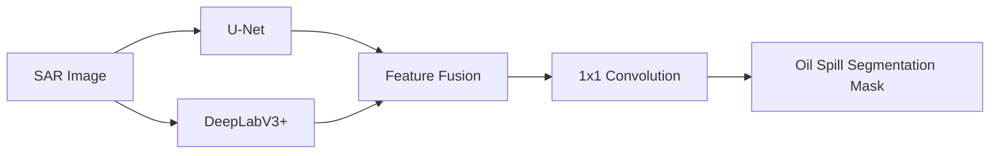
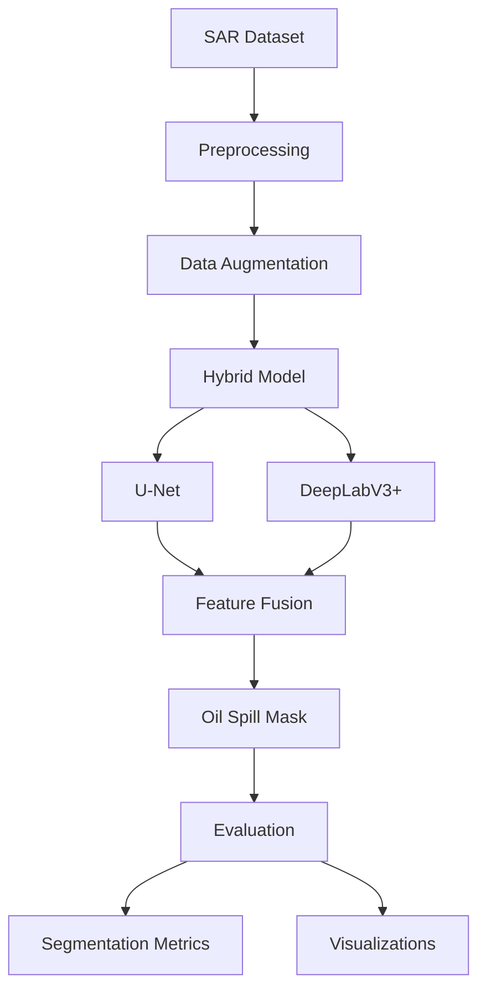

# SAR Oil Spill Segmentation Using Hybrid U-Net and DeepLabV3+

## Overview

This project presents a hybrid deep learning framework for detecting and segmenting oil spills in Synthetic Aperture Radar (SAR) images. The framework combines **U-Net** and **DeepLabV3+** to leverage both detailed spatial features and multi-scale contextual information.

The approach is designed to address key challenges in SAR-based oil spill detection, including speckle noise, low contrast between oil spills and their mimics, and severe class imbalance.

## Key Features

* Hybrid **U-Net + DeepLabV3+** segmentation architecture
* ResNet34 encoder with ImageNet pretrained weights
* Feature-level fusion using a 1×1 convolutional layer
* Hybrid **Dice + Focal + BCE loss** for class imbalance
* SAR-specific data augmentation
* GPU acceleration using PyTorch and CUDA
* Evaluation using Accuracy, Precision, Recall, F1, IoU, Dice, and ROC-AUC
* Segmentation, boundary, and Grad-CAM visualizations

## Architecture



The U-Net branch provides effective spatial feature reconstruction through its encoder-decoder structure, while DeepLabV3+ captures multi-scale contextual information using Atrous Spatial Pyramid Pooling (ASPP).

## Dataset Structure

```text
dataset/
├── images/
│   ├── train/
│   └── val/
└── masks/
    ├── train/
    └── val/
```

Masks are converted into binary segmentation masks:

```text
0 - Background
1 - Oil Spill
```

## Data Augmentation

The training pipeline includes:

* Horizontal and vertical flipping
* Random rotation
* Random resized cropping
* Brightness and contrast adjustment
* Gaussian noise
* CLAHE enhancement
* Normalization

Input images are resized to **256 × 256 pixels**.

## Loss Function

To handle the severe imbalance between oil-spill and background pixels, the model uses a hybrid loss:

```text
Loss = 0.5 × Dice Loss
     + 0.3 × Focal Loss
     + 0.2 × BCE Loss
```

This combination improves region overlap while giving greater importance to difficult and minority-class pixels.

## Training Configuration

| Parameter     | Value                     |
| ------------- | ------------------------- |
| Architecture  | Hybrid U-Net + DeepLabV3+ |
| Encoder       | ResNet34                  |
| Input Size    | 256 × 256                 |
| Batch Size    | 4                         |
| Epochs        | 20                        |
| Optimizer     | AdamW                     |
| Learning Rate | 1e-4                      |
| Weight Decay  | 1e-4                      |
| Scheduler     | Cosine Annealing          |
| Random Seed   | 42                        |

## Evaluation

The model is evaluated using:

* **Accuracy**
* **Precision**
* **Recall**
* **F1 Score**
* **Intersection over Union (IoU)**
* **Dice Score**
* **ROC-AUC**

The project also provides training/validation curves, confusion matrices, class distribution analysis, segmentation results, boundary overlays, and Grad-CAM visualizations.

## Installation

```bash
pip install torch torchvision segmentation-models-pytorch albumentations torchmetrics opencv-python numpy matplotlib scikit-learn seaborn tqdm
```

## Usage

1. Place the SAR images and corresponding masks in the required dataset structure.
2. Update the `DATASET_PATH` in the notebook.
3. Run the preprocessing and dataset loading cells.
4. Initialize and train the hybrid model.
5. Evaluate the model using the provided segmentation metrics.
6. Generate prediction, boundary, and Grad-CAM visualizations.

## Project Workflow



## Technologies

* Python
* PyTorch
* Segmentation Models PyTorch
* Albumentations
* OpenCV
* NumPy
* Scikit-learn
* Matplotlib
* Seaborn

## Purpose

The primary objective of this project is to develop a robust deep learning approach for oil spill segmentation in SAR imagery.
